# Lesson 1

## 常见算法

### 排序

输入：$a_1, a_2, \cdots, a_n$  
输出：$a_1', a_2', \cdots, a_n'$是$a_1, a_2, \cdots, a_n$的一个重排，且$a_1' \leq a_2' \leq \cdots \leq a_n'$

## 算法复杂度

输入规模：$n \in \mathbb{N}$

### 时间复杂度

所需时间：$T(n) \to +\infty, n \to \infty$

1. **Def1.1.** 称$T(n) = O(f(n))$, 若$\exists c, n_0$使当$n > n_0$时有$T(n) \leq cf(n)$
2. **Def1.2.** $T(n) = \Omega(g(n))$,若$\exists c > 0, n_0 \in \mathbb{N},$当$n > n_0$时，有
$$T(n) \geq cg(n)$$
3. **Def1.3.** 称$T(n) = \Theta(h(n))$当且仅当$T(n) =O(h(n))$且$T(n) = \Omega(h(n))$
4. **Def1.4.** $T(n) = O(P(n)), \forall c > 0, \exists n_0$，使当$n > n_0$时，有$T(n) < cp(n) \iff T(n) = O(p(n))$且$T(n) \neq \Theta(p(n))$

- **Thm1.** 若$T_1(n)= O(f(n)), T_2(n)= O(g(n))$,则
$$(1)T_1(n) + T_2(n) = O(f(n)+g(n))$$
$$(2)T_1(n) \cdot T_2(n) = O(f(n)g(n))$$
- **Thm2.** 若$T(n)$是$k$次多项式，则$T(n) = \Theta(n^k)$
- **Thm3.** $\forall k, \log^k n = O(n)$

严格地讲，$T(n) \in O(f(n)) = \{T(n)|\exists c, n_0, \forall n > n_0, T(n) \leq cf(n)\}$

### 分治策略

对一个规模为$n$的问题，分成若干个规模更小的子问题（分割），各自解决子问题，合并子问题的解，形成原问题的解.

**eg1.** 输入：一个规模为$n$的已排序数组A.  
输出：指定元素x在A中下表，若不存在则返回null.  
伪代码如下  
$A: a_1, a_2, \cdots, a_m, \cdots, a_n$已排序  
if $a_m$ == $x$ return $m$  
else if $a_m > x$  
在 $A: a_1, a_2, \cdots, a_{m-1}$中二分查找  
else  
在 $A: a_{m+1}, \cdots, a_n$中二分查找

```python
def bisection_search(A, l, r, x):
    if r == l:
        if A[r] == x:
            return r
        else:
            return Null
    m = (r + l) // 2
    if A[m] == x:
        return m
    else if A[m] > x:
        return bisection_search(A, l, m - 1, x)
    else:
        return bisection_search(A, m + 1, r, x)
```

上述算法的复杂度
$$\begin{aligned}T(n) &= T\left(\frac{n}{2}\right) + O(1)\\
&= T\left(\frac{n}{4}\right) + O(1) + O(1)\\
&= \cdots\\
&= T\left(1\right) + O(1) + \cdots + O(1)\\
&= T(1) + O(\log n)\\
&= O(\log n)
\end{aligned}$$
**Proof.** 略，可用数学归纳法.

**eg2.** 计算$X$的$n$次幂，$n \in \mathbb{N}$
```
def power(X,n):
    if n == 0:
        return 1
    p = power(X, n//2)
    if n % 2 == 0:
        return p * p
    else:
        return p * p * x
```
同理，$T(n) = O(\log n).$

**eg3.** 输入：L和R是两个有序的数组.  
输出：L和R合并成一个有序输出.  
解：略

**Master Thm.(主定理)** 若$$T(n) = \begin{cases}
O(1) &n = 1\\
aT\left(\frac{n}{b}\right) + f(n) &n > 1
\end{cases}$$
其中$a = 1, b > 1$，对无穷大的$n, f(n) > 0$，则

- 若$f(n) = O(n^{\log_b a - \varepsilon}), \varepsilon > 0$，则
$$T(n) = O(n^{\log_b a})$$
- 若$f(n) = \Theta(n^{\log_b a})$，则$T(n) = O(n^{\log_b a\log n})$
- 若$f(n) = \Omega(n^{\log_b a + \varepsilon}), \varepsilon > 0$且对充分大的$n, af\left(\frac{n}{b}\right) \leq cf(n), c < 1$

主定理体现了分治策略下分割和合并两者谁的代价积累速度越快，最终在复杂度计算中就占优势.

**eg4.** 斐波那契数列$F_n = \begin{cases}1 &n = 0, 1\\
F_{n - 1} + F_{n - 2} &n \geq 2\end{cases}$.
```
def Fib(n):
    if n == 0 and n == 1:
        return 1
    return Fib(n - 1) + Fib(n - 2)
```
$T(n) = T(n - 1) + T(n - 2) = O(2^n)$

在问题规模几乎不变的情况下需要花指数级的时间。下面给出更好的分治策略，我们考虑如下引理

**Lemma.**
$$\begin{pmatrix}
F_{n + 1} & F_n\\
F_{n} & F_{n - 1}
\end{pmatrix} = \begin{pmatrix}
1 & 1\\
1 & 0
\end{pmatrix}^n$$

**Proof.** 数学归纳法，略.

利用上述引理可以将求解斐波那契数列的问题转化为eg2的问题，复杂度
$$T(n) = 8T\left(\frac{n}{2}\right) + O(n^2) = O(n^3)$$
代码实现见[`lesson1/src/Fibonacci.c`](lesson1/src/Fibonacci.c).

可以看出，影响算法复杂度的主要是分割，即矩阵乘法的部分。事实上进一步地，通过对矩阵乘法部分的优化，可以将复杂度压缩至$O(n^3)$以下，这里不再赘述。

# Lesson 2
## 列表（List）、栈和队列
### 抽象数据类型（ADT, abstract data type）
- 数据的构成
- 对数据的操作

#### List（ADT）
序列：$\{A_0, A_1, \cdots, A_{N - 1}\}$长度为$N$，其中所有数据类型相同. 长度为$0$的序列\{ \}称为空列表.

操作：printList(), makeEmpty(), insert(idx, val), remove(val), find(val)

上面的序列和操作共同构成一个ADT.
___
#### 数组（Array）
```c
int a[10];  // 在计算机内存中寻找可以放下10个整型数据的连续空间
```
具体实现见`lesson2/src/memory.c`
___
#### List ADT
- 属性
  - int size;
  - double *data;
- 操作
  - init(int_maxSize);
  - printList();

为什么不用struct？如下图，用户在外界可以修改ArrayList内部的属性，从而导致在line16看似合理的循环中发生越界
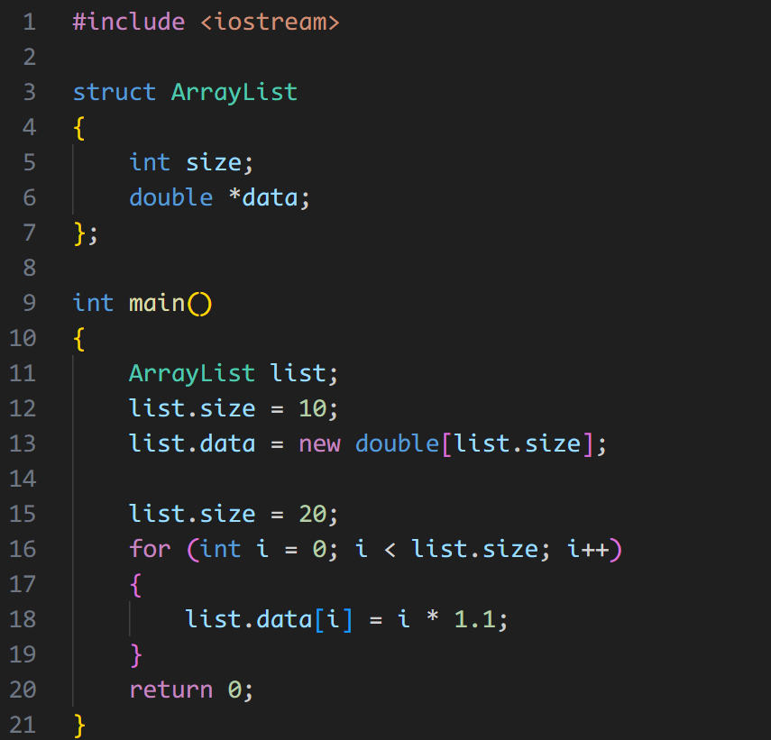
于是我们使用class，在写好[`ArrayList.h`](lesson2/src/ArrayList.h)后，在头文件中include后就可以把`ArrayList`作为一个自带的类型使用了.

**eg.** 定义`ArrayList`后，先用`ArrayList`写了一个“学生类”，再用`ArrayList`写了一个“排序类”，最后利用以上两者写了一个“成绩类”。在实际开发过程中，很容易出现这样的重复定义问题。我们使用一种非常传统的方式来规避
```
# ifndef __HAJIMINAMEILUDUO_ARRAYLIST__  // 非常奇怪的名字，越怪越好以防和别人重复
# define __HAJIMINAMEILUDUO_ARRAYLIST__

// 定义，略

# else
// DO NOTHING
# endif
```
<!-- 总而言之如果一个代码有问题，那都是你脑子有问题——why -->

# Lesson 3
代码实例讲解，略

# Lesson 4
代码实例讲解，略

# Lesson 5
## 堆栈（Stack）/ 队列（Queue）
- 特点
  - 堆栈：Last In First Out（LIFO）
  - 队列：First In First Out（FIFO）
- 应用
  - 堆栈：函数的嵌套调用（A $\rightarrow$ B $\rightarrow$ C，C最先执行）
  - 队列：12306
- 操作
  - push：插入一个新元素
  - pop：读取并删除一个元素（弹出）
  - top：读取下一个会被弹出的元素
  - size：返回大小
  - empty：判断是否为空

### 堆栈
利用堆栈解决括号序列的合法性（见 [`lesson5/src/isValid.cpp`](lesson5/src/isValid.cp)）

#### 后缀表达式
数域$\mathbb{F}$上的二元运算（+，$\times$）是一个从$\mathbb{F}^2$到$\mathbb{F}$的函数，一般有三种表示方法：
- 前缀表达式：$\times (a, b)$
- 中缀表达式：$a \times b$
- 后缀表达式：$a b \times$

我们考虑后缀表达式，算式
$$a + b \times c + (d \times e + f) \times g$$
可以表示为
$$abc*+de*f+g*+$$
不难发现后缀表达式的运算顺序为从左到右，消除了括号，十分方便。如何实现中缀表达式到后缀表达式的转化？可以利用栈来解决：

基本步骤：
1. 操作数：直接输出到表达式
2. 运算符：根据运算符优先级顺序+, - < *, /, % < ^处理
3. 左括号：直接入栈
4. 右括号：弹出栈中运算符直到左括号

优先级比较：
```
while (!stack.empty() && 优先级(stack.top()) >= 优先级(当前运算符))
{
    弹出栈顶运算符并输出
}
当前运算符入栈
```
有关后缀表达式的运算具体实现见[`lesson5/src/calcRPN.cpp`](lesson5/src/calcRPN.cpp)（不含括号运算符）

### 队列
伪代码实现部分操作如下
```
push(a):
    tail = tail + 1
    if (tail < queue.size):
        queue[tail] = a
    else:
        tail = tail - queue.size
        if (tail != head):
            queue[tail] = a

pop(a):
    if (head != tail):
        result = queue[head]
        ++head
        return result
```
## 树（Trees）
树是 $n$（$n \geq 0$）个节点的有限集合。当 $n = 0$ 时，称为空树。在任意一棵非空树中：

- 有且仅有一个特定的称为根（Root） 的节点

- 当 $n > 1$ 时，其余节点可分为 $m$（$m > 0$）个互不相交的有限集合 $T_1, T_2, ..., T_m&，其中每一个集合本身又是一棵树，并且称为根的子树（Subtree）
```
      A        ← 根节点
     /|\
    B C D      ← A的子节点
   / \   \
  E   F   G    ← B和D的子节点
```
通常我们仅考虑树的一种形式，即二叉树（Binary Tree），每个节点仅有两个分支
```
     Root
     / \
   T_L T_R

struct BinaryNode
{
    Obj ele;
    BinaryNode* Left;
    BinaryNode* Right;
}
```
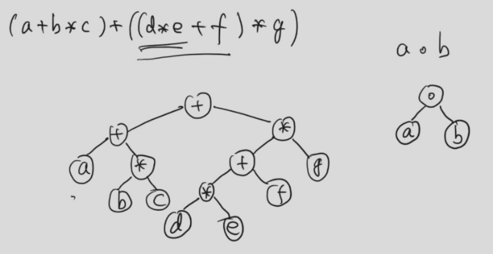
通过不同的遍历方式，可以将表达式还原为不同的表达式
- 先序遍历（“自 左 右”） $\iff$ 前缀表达式
- 中序遍历（“左 自 右”） $\iff$ 中缀表达式
- 后序遍历（“左 右 自”） $\iff$ 后缀表达式

## 二叉搜索树（Binary Search Trees）
二叉搜索树是一种特殊的二叉树，它满足以下性质：
1. 左子树所有节点的值 < 根节点的值
2. 右子树所有节点的值 > 根节点的值
3. 左、右子树也都是二叉搜索树
4. 没有键值相等的节点（通常情况）
不难发现，对二叉搜索树进行中序遍历，将得到一个有序序列。

如何构建二叉搜索树？最直接的方法为逐个插入——
1. 选取某个数作为根
2. 遍历序列，比节点小的元素放在节点的左子树，比节点大的元素放在节点的右子树

显然在最坏的情况下，算法的复杂度为 $O(n)$，我们可以通过找一个尽量靠近中间（不太小也不太大）的元素来避免这种情况，即对二叉树进行左右子树的平衡。在最理想的情况下，每插入一个新节点的代价为 $O(\log n)$，建立一棵二叉搜索树的时间复杂度为 $O(n\log n)$

# Lesson 6
一种对二叉搜索树进行平衡的思想是为每个节点增加一个指标来观察是否平衡，若不平衡则进行局部调整改变平衡性。

子树高度：空子树高定义为-1，非空树高 $=\max\{\text{左子树高}, \text{右子树高}\} + 1$

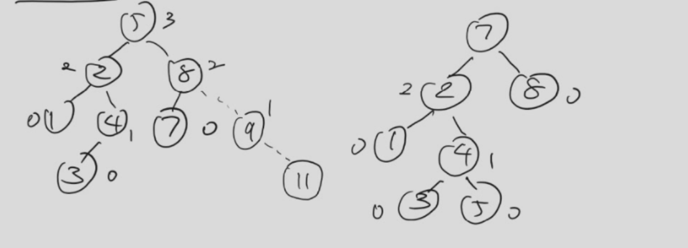

# Lesson 7
下面介绍AVL树。

## AVL树
左右子树高度差不超过定值$C (C = 1)$，即
$$\forall x \in T, |height(x \to \text{left}) - height(x \to \text{right})| \leq C = 1 .$$

- 含有$n$个节点的AVL树的高度满足
  $$h \leq 1.44 \log_2 (N + 2) - 1.328 = O(\log N).$$
- 思路：设高为$h$的AVL树至少有$s(h)$个节点，则
$$s(h) = s(h - 1) + s(h - 2) + 1$$
- 静态操作：$T(n) = O(\log n)$  
- 保持AVL是动态操作的责任：insert/remove
    - 基本步骤：
    1. 做一个BST insert/remove
    2. 检查平衡性
    3. 恢复平衡性
    4. 更新高度  

    其中步骤2.3.4.增加的总工作量不能超过$O(\log n)$
    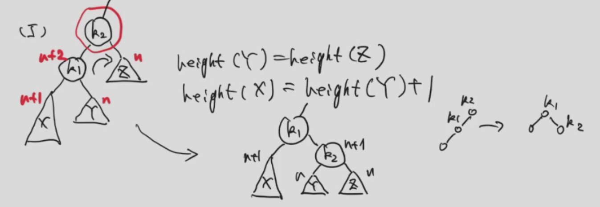
    可以理解为将$X, k_1, k_2$绕$k_1, k_2$轴旋转。
- 两种旋转操作:

  1.单旋转：发生在对**左**子节点的**左**子树进行插入之后（或其镜像情形）。操作时，由树叶向根回溯，对第一个不满足平衡条件的节点先进行旋转。

  2.双旋转：发生在对**左**子节点的**右**子树进行插入之后（或其镜像情形）。第一次旋转的节点，是不满足平衡条件节点的子节点。
  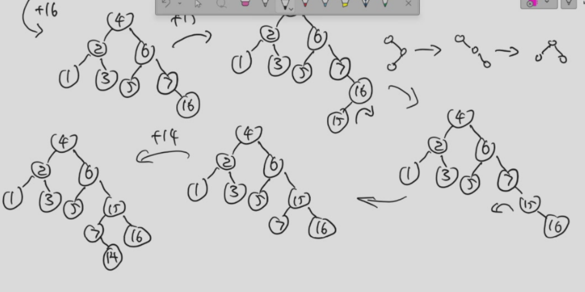

  实际上双旋转可以看做两次单旋转的复合，因此只需实现单旋转即可.

# Lesson 8
回顾前几节课的经历
1. BST，能排序，$T(n) = O(n^2)$
2. AVL树，结构上是BST，通过跟踪维护树高（height）确保树不太不平衡，$h = O(\log n), \quad T(n) = O(n \log n)$

## 伸展树（splay tree）
接下来我们介绍伸展树

- 伸展树本质上是BST
- 但不能保证单次操作时间上界是$\Theta(\log n)$，只能保证$\Theta(n)$
- 保证对充分大的$M$，连续的$M$次操作的总时间是$O(M \log n)$，因此“平均”每次操作的代价是$O(\log n)$.定义摊还时间（the amorized run time）：若一个由$M$次操作组成的操作序列的总时间上限是$O(Mf(n))$，则称其摊还时间为$O(f(n))$，这里的平均指的就是摊还时间

下面考虑一个简单的方案：实现函数find x，但每次找到对应节点就把节点通过旋转移动到根
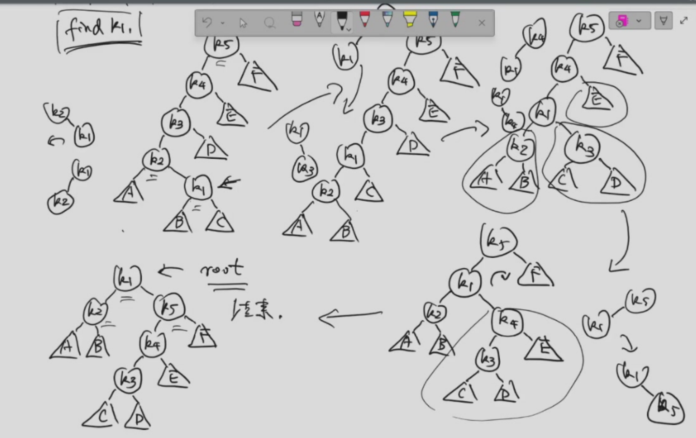
注意到当我们按照$k_1, k_3, k_1, k_3, \cdots$的顺序访问节点时，时间代价非常大（$O(Mn)$）.这个例子虽然行不通，但对我们有一定启发

### 伸展
find(x)：观察x及其parent、grandparent
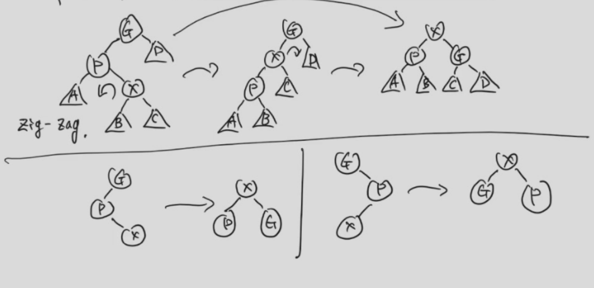
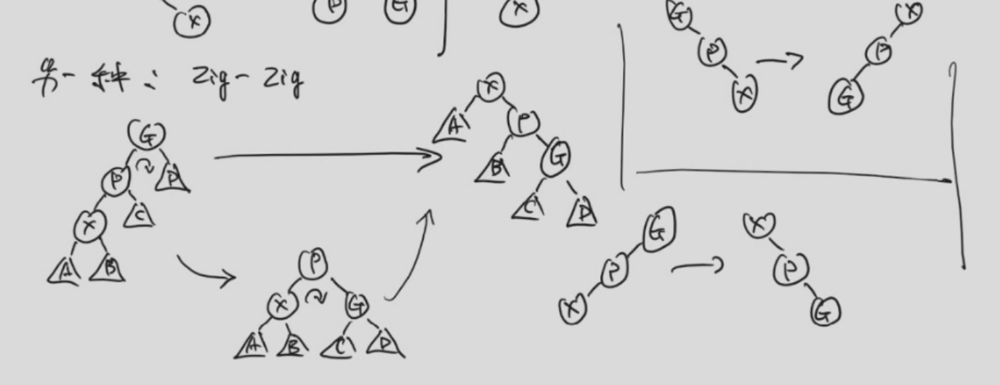
考虑最坏的情况：依次插入$1, 2, \cdots, N$（BST insert + splay）
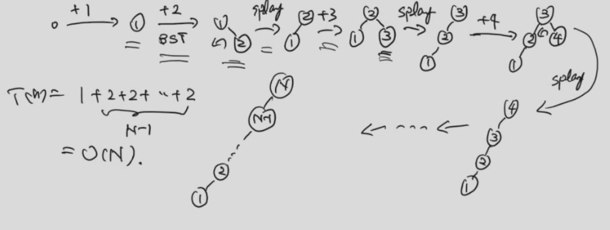
接下来find(1)
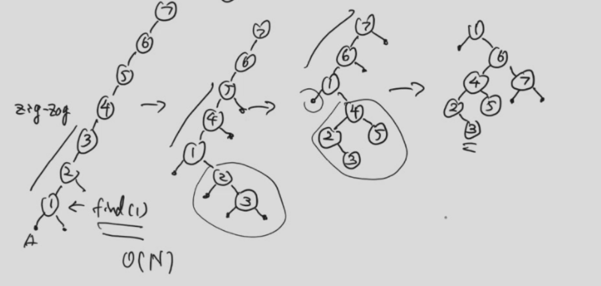
此时再find(3)，发现时间复杂度变为$O\left(\dfrac{n}{2}\right)$

我们发现做了一件非常复杂的事情（find(1)）后，树相较之前变得非常平衡，反而越能帮助我们接下来提高效率.类似地，做的事情越简单，树平衡速度越慢（甚至高度增加）.反复进行这样的操作，从概率论角度看，树会变得几乎平衡.按照这样的思路，我们可以证明摊还时间恰为$O(\log n)$

在伸展树下，删除操作remove(x)：
1. find(x)
2. delete(x)，得到两个子树TL和TR
3. 找到TL的最大节点TLmax，将其提升到TL的根（即find(TLmax)）
4. 把TR挂在TLmax的右子树

这是一个更简单的实现.

## B-树（B-Trees）
B-树（M-ray）：
1. 数据都存放在叶节点
2. 非叶子节点存放至少$M - 1$个键值，引导查找，其中第$i$个键表示第$i + 1$棵子树中的最小值
3. 根节点要么是叶子，要么有至少$2$到$M$个孩子
4. 除根以外，所有非叶子节点都有$\lceil\dfrac{M}{2}\rceil$到$M$个孩子
5. 所有叶子都在同一深度，且每个叶子包含$\lceil\dfrac{L}{2}\rceil$到$L$个数据项，$L$是常数
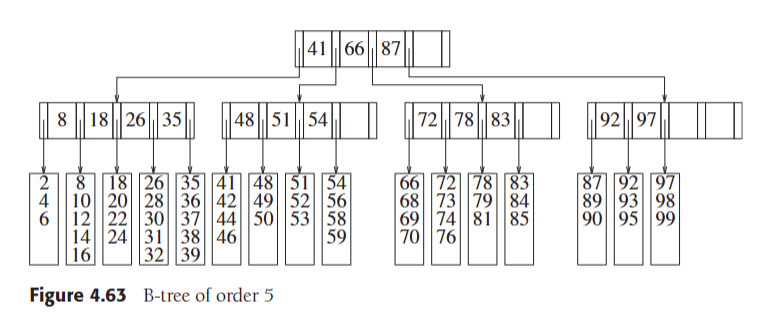
- 删除：  
  1. 直接删除，直到叶子节点中存储树小于$\lceil\dfrac{L}{2}\rceil$
  2. 此时向邻居要一个孩子
  3. 若邻居只有$\lceil\dfrac{L}{2}\rceil$个孩子，合并两个节点
  4. 若根节点合并后只有一个孩子，那么删除根节点.（降低树）

## 散列表/哈希表（hash）
我们过去学习的一些数据结构
- List
  - Array：静态$O(1)$，动态$O(n)$
  - Linked List：静态$O(n)$，动态$O(1)$
- AVL Tree：静态/动态$O(\log n)$
是否存在更好的数据结构满足静态/动态$O(1)$？

理想的哈希表数据结构仅仅是一个固定大小的数组，其中存放着数据项（key, value）.通过哈希函数$h(\text{key})$将key映射为0到tableSize - 1中的一个整数.理想情况下，哈希函数应当易于计算，并确保任何两个不同的键都能映射到不同的存储单元.但由于key是无限的，而tableSize是有限值，$h(\text{key})$不是一个双射，因此这显然是不可能实现的.于是，我们转而寻求一种能将键均匀分布在各个存储单元中的哈希函数.
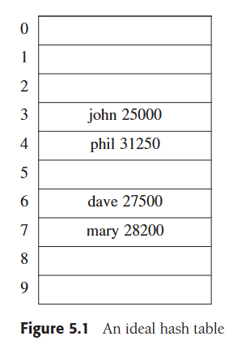

# Lesson 9
每一条数据都有固定结构：{key, data}，在接下来的讨论中我们主要关心每个key怎么存，所有数据构成由key构成的集合
$$S = \{k_1, k_2, \cdots, k_n\}$$
其中$k_i$是键值，$i = 1, 2, \cdots, n$.
注意$S$是一个有限集，其规模可以随时间变化.

映射$h:S \to \{0, 1, \cdots, \text{TableSize} - 1\}$.复杂度为$O(1)$，与数据规模无关.随着$S$中数据的不断加入，$\exists k_i, k_i$满足$h(k_i) = h(k_j)$发生的概率不为零，称为碰撞.碰撞的发生是无法避免的，一种解决方法是将每个行对应的空间处理为链表.最坏的情况下，$\forall k \in S, h(k) = i$，所有数据全部碰撞到第$i$行，复杂度为$O(n)$.

而在最好的情况下，$\forall j \in S, \forall i \in \{0, 1, \cdots, m - 1\}, P(h(k) = i) = \dfrac{1}{m}$，每行链表长度期望为$\lambda = \dfrac{n}{m}$，称为装载因子（load factor）.这种假设称为简单均匀假设，复杂度为$O(1)$.

不难发现设计哈希函数与设计伪随机数类似，要求$\forall k \in S$，$h(k)$在$0$到$m - 1$中取值的可能性相等.
- 除同余方法
$$h(k) = k \mod m.$$
不好的hash映射：将$S$中$key$的分布特征保持到$h(S)$中.取$m$为不太小的素数可以避免.又由于计算机二进制的特性，当$m = 2^k$时运算代价较小.
- 乘法方法：取$m = 2^r$，设计算机字长是$w$，则
$$h(k) = (A \times k \mod 2^w) \ll (w - r)$$
其中$A$是满足$2^{w - r} < A < 2^w$的一个奇数.  
例$m = 2^3 = 8, w = 7, r = 3$.
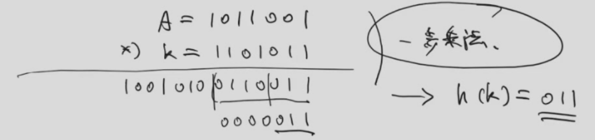
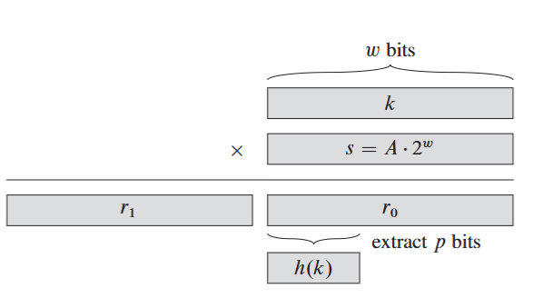

## 无链表哈希法
准备一个哈希函数列：$h_0(x), h_1(x), \cdots$
$$\begin{cases}
h_i(x) = (\text{hash}(x) + f(i)) \mod m, \\
f(0) = 0, \\
f(i)\text{是一个简单函数}
\end{cases}$$

### 线性探测
即$f$是$i$的线性函数，如$f(i) = i$.
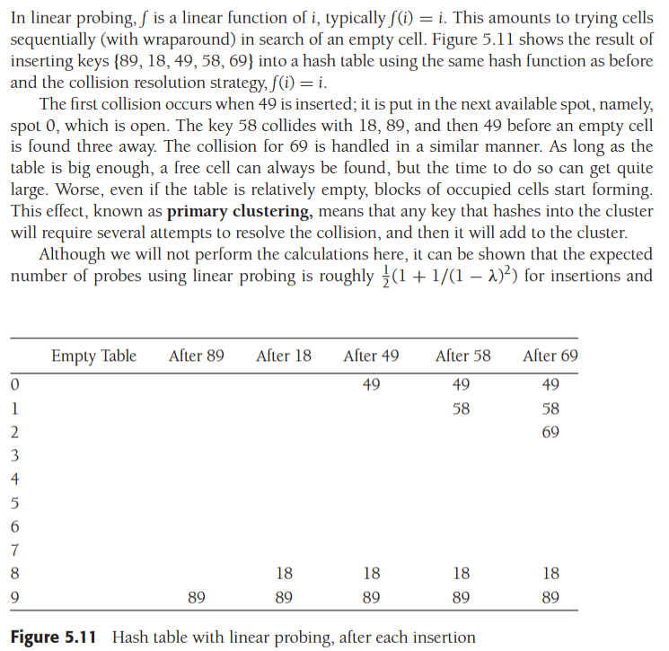
当发生连续占位的情况，任意进入连续区间的探测，都必然会探测全部剩余占位，并插入连续区的后一个位置，形成初级聚集（primary clusfering）.

### 二次探测
$f(i) = i^2$
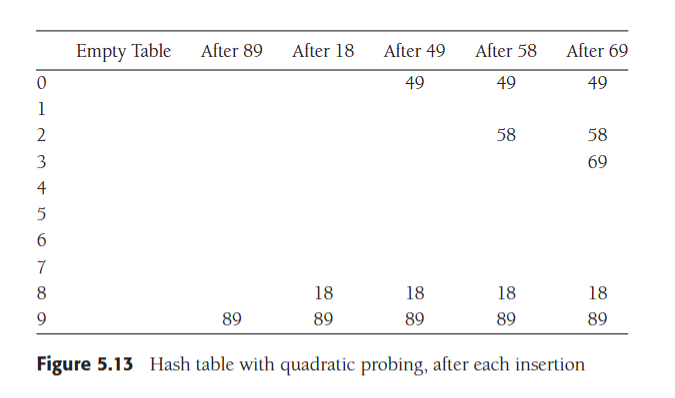
**Thm5.1.**若使用二次探测，且表长度为素数，则当$\lambda \geq 0.5$时，经充分长的探测，总可以找到空位.

证明：$m$是大于3的素数，证明前$\left[\dfrac{m}{2}\right]$个探测位置都是不同的（包括$h(0)$）.取其中两个位置：
$$(h(x) + i^2) \mod m, \quad (h(x) + j^2) \mod m.$$
其中$0 \leq i, j \leq \left[\dfrac{m}{2}\right]$.假设$h_i = h_j$，但$i \neq j$.则
$$h(x) + i^2 \equiv h(x) + j^2 \mod m$$
$$(i + j)(i - j) \equiv 0 \mod m$$
由$m$是素数得出矛盾.

启示：
1. 控制$\lambda < 0.5$
2. $m$必须是素数.

### 双重哈希
$f(i) = i \cdot \text{hash}_2(x), \quad \text{hash}_2(x) = R - (x \mod R),$
其中$R$是小于$m$的一个素数.
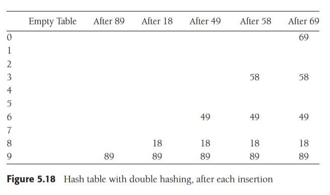

## 重新哈希（Rehashing）
当哈希表过满时，通过扩大哈希表容量并重新计算哈希值解决.

## 最坏情况下$O(1)$访问的哈希表
$\lambda = 1$.给定$N$个球，均匀随机放置在$N$个箱子里，球最多的箱子有几个球？

### 完美哈希（Perfect Hashing）
**Thm5.2.**若$N$个球放入$M = N^2$个箱子中，那么没有任何一个箱子包含超过一个球的概率小于$\dfrac{1}{2}$.

**Thm5.3.**若将$N$条记录放到$N$个箱子的主哈希表中，那么二级哈希表的总大小 的期望为$2N$.

### 布谷鸟哈希（Cuckoo Hashing）
在布谷鸟哈希中，假设有$N$个物品。我们维护两个表，每个表都留有一半以上的空位，并配备两个独立的哈希函数，可将每个物品映射到两个表中的对应位置。布谷鸟哈希保持这样的不变性：每个物品始终存储在这两个位置之一。
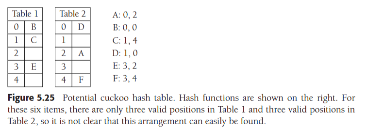

### 跳房子哈希（Hopscotch Hashing）
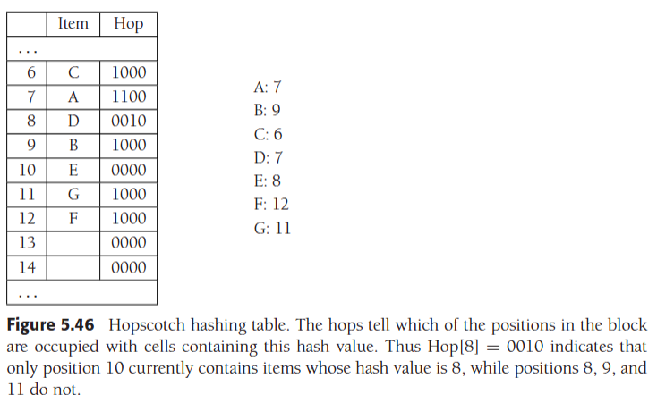

# Lesson 10
### 通用哈希（Universal Hashing）
$\forall h \in H$，有
1. 计算代价$O(1)$；
2. $h(x), x$是key.$h(x)$均匀分布在$0 \sim ~ M - 1$

**Def5.1.**$\forall x \neq y$，$H$中满足$h(x) = h(y)$的哈希函数的数量最多为$\dfrac{|H|}{M}$个，则称$H$是通用的.

如何构建$H$？
$$H = \{H_{a, b}(x) = ((ax + b) \mod p) \mod M\},$$
其中$1 \leq a \leq p - 1, 0 \leq b \leq p - 1, p$是素数且比最大的键值大.例如
$$H_{3, 7}(x) = ((3x + 7) \mod p) \mod M.$$

## 优先队列，堆（Priority Queue, Heap）
### 简单实现（二叉堆，Binary Heap）
1. 二叉堆是一个完全二叉树（complete binary tree）.
2. 任何除叶子节点以外的节点的值必须小于左、右孩子的值.
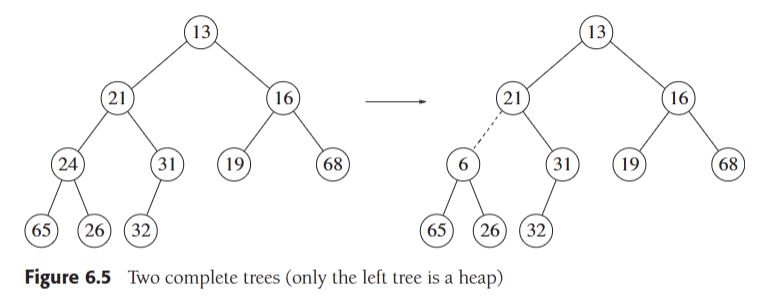
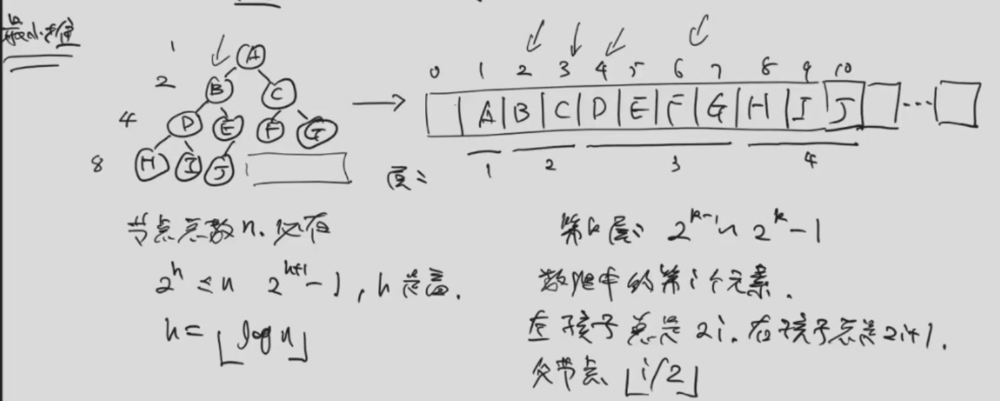

### 基本操作
- insert
  1. 将新元素添加到堆的末尾.
  2. 向上调整直到堆性质恢复（$O(\log N)$，最多$h = \lfloor \log N \rfloor$次交换）.

  或更简单地，
  1. 将新元素放入0位.
  2. 在堆的末尾插入空格，检查新元素插入后是否满足堆性质.若满足则为该位置赋值新元素，若不满足则赋值父节点元素，将空格移动到父节点（移动步骤无需赋值，在下一次比较中赋值覆盖）.重复本步骤直到堆性质恢复（最多$h + 1 = \lfloor \log N \rfloor + 1$次赋值）.
- deleteMin
  1. 移除根节点.
  2. 将最后一个元素移到根位置.
  3. 向下调整直到堆性质恢复.

  同样可以通过类似的方法将替换优化为赋值.
- 其他操作
  - decrease(p, D)
  - increase(p, D)
  - remove(p)

  不做一一介绍.

### 建堆
先将元素按初始属性全部插入数组，再做升降堆操作.则第$i$层至多$2^i$个节点，每个节点至多$(h - i)$次交换.
$$S = \sum_{i = 0}^{h} 2^i(h - i) = (2^{h + 1} - 1) - (h + 1) = \Theta(n).$$

### 选择问题
第$k$个最小元素（rank-k problem）：给定$n$个元素，选出第$k$小的元素.

### 多叉堆（d-Heaps）
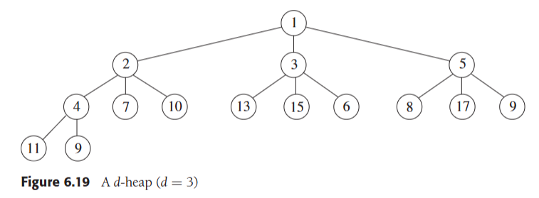

### 左堆（Leftist Heaps）
1. 二叉树
2. 堆性
3. 扩展属性

定义：$\forall x \in T, \text{npl}(x)$为从$x$到没有两个子节点的节点的最短路径长度（null path length）.空节点的npl值为-1，单节点的npl值为0.

$\forall x \in T$，左子节点的npl至少与右子节点的npl值一样大，这样的堆称为左堆.
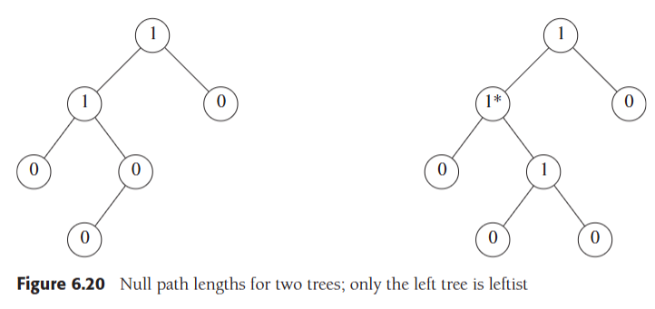

定理：若一个左堆的右路径上有$r(\log n)$个节点，则它总共至少有$2^r - 1(n)$个节点

操作：
- insert $\iff$ merge(当前堆, 单节点)
- deleteMin $\iff$ 删除根，merge(TL, TR)

于是关键问题转化为merge操作.
- merge(H1, H2)：（递归）
  1. 若H1或H2为空堆，则返还另一个.（递归退出）
  2. 否则比较H1.root和H2.root  
  不妨设H1.root更小，则merge(H2, H1.right)作为H1的右子树.
  3. 若H1的右子树npl更大，则交换H1的左右子树.
  4. 更新H1根节点的npl.

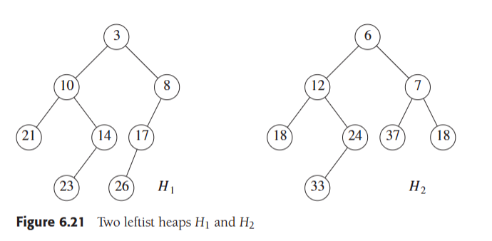
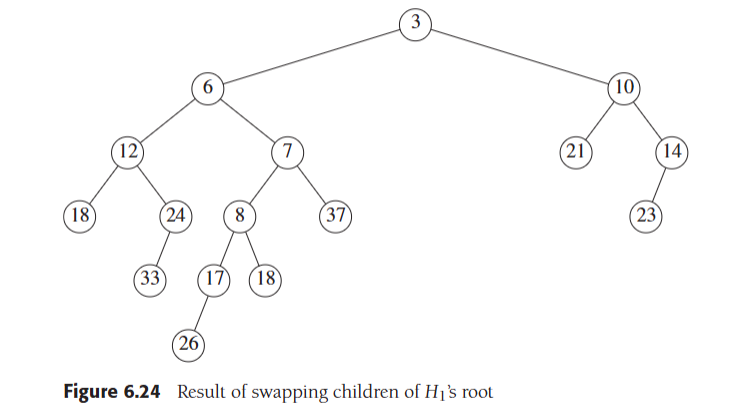

### 斜堆（Skew Heap）
类似AVL树不维护高度，左堆不维护npl则发展为斜堆.

斜堆合并：
- skew_merge(H1, H2)
  1. 如果一个队为空，则返回另一个堆.（递归退出）
  2. 比较H1和H2的根节点值，若H1.root较大则交换H1.root和H2.root，否则不变.
  3. skew_merge(H1.right, H2)，合并结果作为H1的新左子树.交换H1的左右子树.
  4. 返回合并后的新根节点.
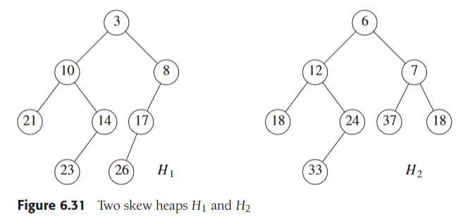
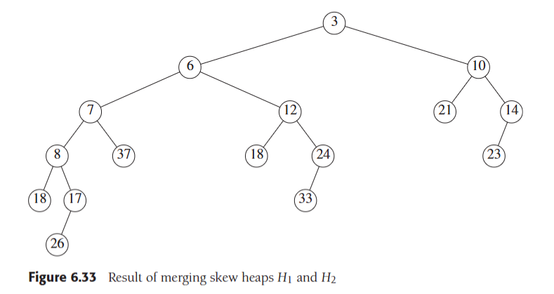

## 二项队列（Binomial Queues）
### 二项树（binomial tree）
1. 高度为0的二项树$B_0$就是单节点.
2. 高度为$k$的二项树$B_k$定有子树$B_0, B_1, \cdots, B_{k - 1}$

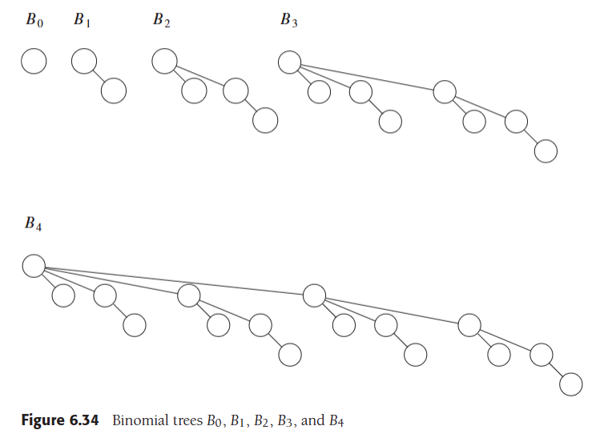

不难发现$B_k$中有$2^k$个节点，$B_k$中深度为$k$的节点总数是$\dbinom{k}{d}$

定义二项队列：
1. 由$B_0, B_1, \cdots, B_k$组成.
2. 每一个$B_i$都保持堆性质.
3. 每个高度至多一棵$B_i$树.

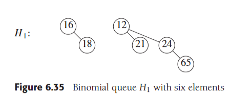

# Lesson 11
## 排序
- 稳定性（stable）：待排数组中的重复元素，排序之后不改变它们的原始相对位置.
- 原地性（in-place）：用于排序的缓存量是$\Theta(1)$.
- 效率/复杂性：
  - 归并排序：$O(n\log n)$.
  - AVL-Tree：$O(n\log n)$.

### 简单算法
插入排序（Insertion Sort）
```
def insertion_sort(A):
    for j in range(1, len(A)):
        key = A[j]
        i = j - 1
        while i >= 0 and A[i] > key:
            A[i + 1] = A[i]
            i = i - 1
        A[i + 1] = key
```
$T(n) = O(n^2)$，这是由于插入排序只会交换相邻元素.

**Thm7.1** $N$个不同元素的数组中平均逆序对有$\dfrac{N(N - 1)}{4}$.

**Thm7.2** 交换相邻元素算法复杂度$\Omega(N^2)$.

希尔排序（Shellsort）
```
def shell_sort(A):
    gap = len(A) // 2
    while gap > 0:
        for i in range(gap, len(A)):
            key = A[i]
            j = i
            while j >= gap and A[j - gap] > key:
                A[j] = A[j - gap]
                j = j - gap
            A[j] = key
        gap = gap // 2
```
$T(n) = O(n^{1.3})$，不稳定，原地排序.事实上，间隔序列gap的选取对效率有很大影响.

堆排序（Heapsort）
1. 将数组看作满二叉树.
2. 建最大堆.
3. 交换堆顶元素和最后一个元素，堆大小减1，重新调整堆.
```
def heap_sort(A):
    build_max_heap(A)
    for i in range(len(A) - 1, 0, -1):
        A[0], A[i] = A[i], A[0]
        max_heapify(A, 0, i)
```
$T(n) = O(n\log n)$，不稳定，原地排序.

归并排序（Merge Sort）
```
def merge_sort(A):
    if len(A) > 1:
        mid = len(A) // 2
        L = A[:mid]
        R = A[mid:]

        merge_sort(L)
        merge_sort(R)

        i = j = k = 0
        while i < len(L) and j < len(R):
            if L[i] < R[j]:
                A[k] = L[i]
                i += 1
            else:
                A[k] = R[j]
                j += 1
            k += 1

        while i < len(L):
            A[k] = L[i]
            i += 1
            k += 1

        while j < len(R):
            A[k] = R[j]
            j += 1
            k += 1
```
$T(n) = O(n\log n)$，稳定，非原地排序.

快速排序（Quick Sort）
```
def partition(A, low, high):
    pivot = A[high]
    i = low - 1
    for j in range(low, high):
        if A[j] < pivot:
            i += 1
            A[i], A[j] = A[j], A[i]
    A[i + 1], A[high] = A[high], A[i + 1]
    return i + 1

def quick_sort(A, low, high):
    if low < high:
        pi = partition(A, low, high)
        quick_sort(A, low, pi - 1)
        quick_sort(A, pi + 1, high)
```
$T(n) = O(n\log n)$平均，$O(n^2)$最坏，非稳定，原地排序.

**Thm** 基于比较的排序，最优效率是$\Theta(n\log n)$
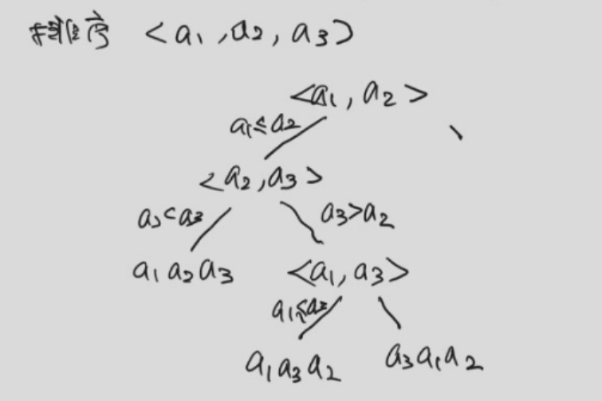
任意基于比较的排序算法，都会经历决策树的每一个节点.
1. 该树的叶子总数$n!$.
2. 该树是二叉树，高度$2^h \geq n!$
$$\begin{align*}
&\Rightarrow h \geq \log(n!) \geq \log\left(\frac{n}{e}\right)^n \\
&\Rightarrow h \geq n\log\frac{n}{e} = \Omega(n\log n).\end{align*}$$

### 线性时间排序
$$T(n) = \Theta(n).$$

计数排序（counting sort）
- 输入：A[1, …, n]，任意A[i]都是1~k之间的整数.
- 输出：B[1, …, n]，A的升序重排.
- 缓存：C[1, …, k]（k可能远大于n）.
```
def counting_sort(A, k):
    C = [0] * (k + 1)
    for j in range(len(A)):
        C[A[j]] += 1
    for i in range(1, len(C)):
        C[i] += C[i - 1]
    B = [0] * len(A)
    for j in range(len(A) - 1, -1, -1):
        B[C[A[j]] - 1] = A[j]
        C[A[j]] -= 1
    return B
```
$T(n) = \Theta(n + k)$，稳定，非原地排序.

基数排序：
当k较大时，按照从低位到高位的顺序，依次进行k = 10的计数排序，由于算法的稳定性，保证了最终结果是有序数组，降低了算法代价.

# Lesson 12
## 并查集
### 等价关系
称$R:S \times S \to \{\text{True}, \text{False}\}$为一个关系.特别地，若$R(a, b) = \text{True}$，我们称$a$与$b$相关，并记作$a R b$.

称$R$是一个等价关系（equivalence relation），若满足：
- 自反性（reflexive）：$\forall a \in S, a R a$；
- 对称性（symmetric）：$a R b \iff b R a, a, b \in S$；
- 传递性（transitive）：$a R b \land b R c \Rightarrow a R c, a, b, c \in S$.

### 动态等价问题
若$S$中存在等价关系~，那么$\forall a \in S$，和$a$等价的元素构成的集合为$S$中包含$a$的等价类（equivalence class）.

$S$关于~可以看作等价类的划分：$S/~, \forall a \in S$，$a$属于且仅属于$S$中的一个等价类.且$\forall S_i, S_j \in S/~, S_i \cap S_j = \varnothing$，但$\bigcup\limits_i S_i = S$.

对于一个离散的集合$S = \{a_1, a_2, \cdots, a_n\}$，可以用真值表来规定一个具体的关系.

基本操作：
- find：$\forall a \in S$，find($a$)返回当前$a$所在的等价类$S_i$.
- union：union($a, b$)$\quad a, b \in S$，使得$a ~ b$.  
操作前：$a \in S_i, b \in S_j, S_i, S_j \in S/~$；  
操作后：新增$S_k \in S/~, S_k = S_i \cup S_j$，删除$S_i, S_j$

假设$S = \{0, 1, \cdots, N - 1\}$，初始划分为$S/~ = \{S_0, S_1, \cdots, S_{N - 1}\}, S_i = \{i\}$.
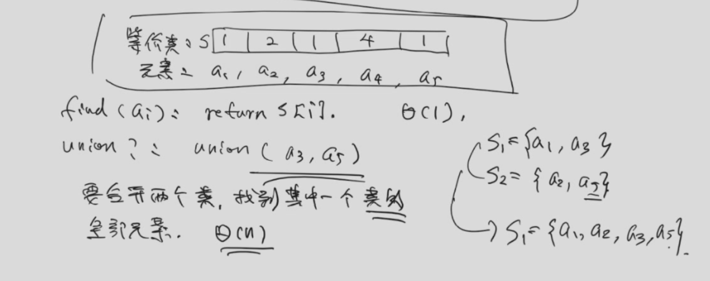

### 基本数据结构
用不同的树来表示不同的等价类，整个商集就是一个森林（forest）.
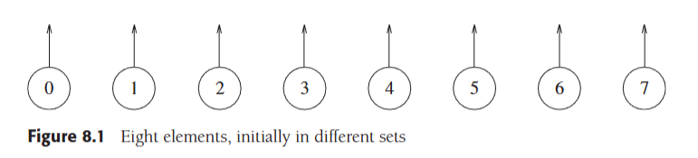
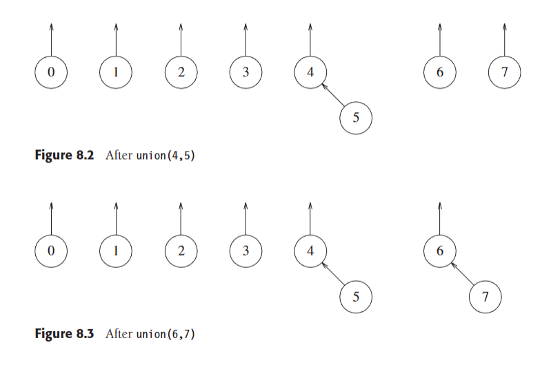
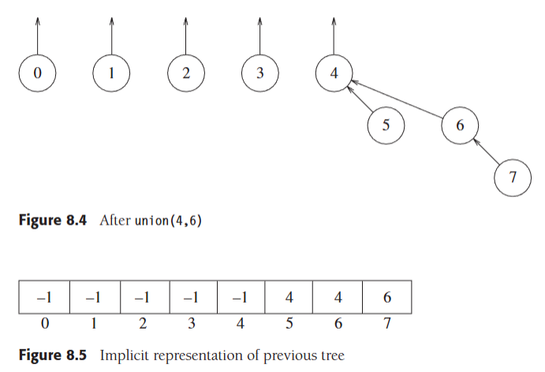

### 聪明的合并
一个简单的改进方法是总是将较小的树作为较大树的子树，这种合并方法称为按大小合并.由于我们实际上只使用一个数组，我们可以让每个根节点的数组条目存储其树大小的负值.
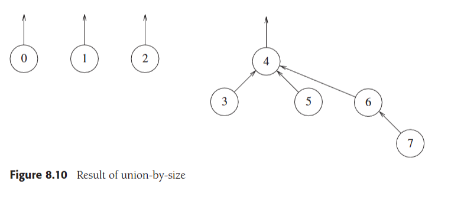
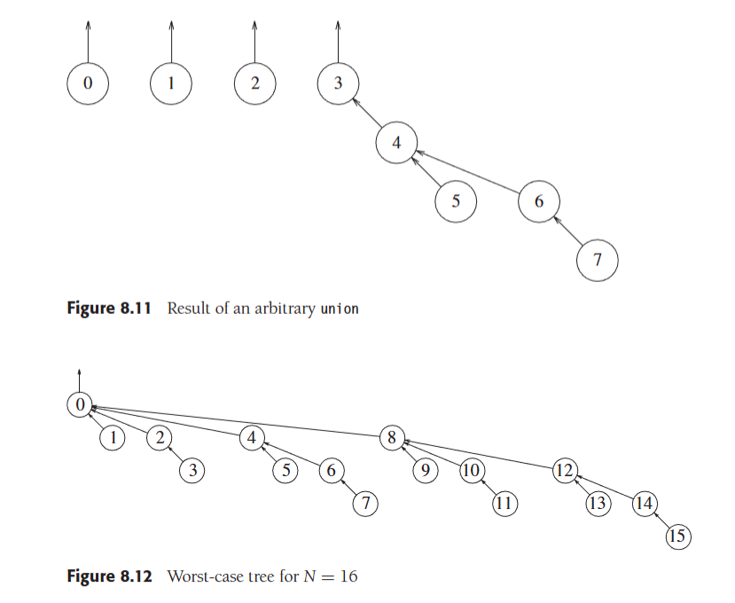
当$n = 2^k$时，最坏可能是一颗$\text{B}_\text{k}$树.

另一种也能保证所有树的深度不超过$O(log N)$的实现方式是按高度合并.我们跟踪每棵树的高度，并在合并时让较浅的树成为较深树的子树.这是一个简单的算法，因为只有当两棵深度相同的树合并时，树的高度才会增加.因此，按高度合并是对按大小合并的微小修改.由于高度为零时不能为负值，我们实际上存储的是高度的负值再减1.初始时，所有数组条目均为-1.
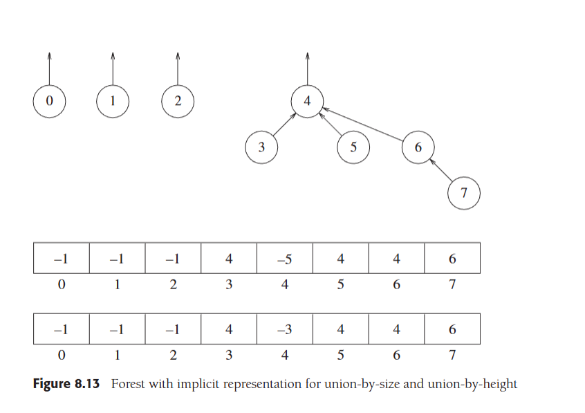

### 路径压缩
在进行find操作时，如果发现一个元素属于某类就将它的parent改为它的root，能改善find的效率.

### 迷宫生成
生成迷宫的一种简单算法是：初始时，在所有相邻单元格之间都设置墙壁.然后，我们不断随机选择一堵墙，如果这堵墙所分隔的两个单元格尚未彼此连通，就将其拆除.重复这一过程，直到起点和终点连通为止，此时便得到了一个迷宫.（实际上，更好的做法是继续拆除墙壁，直到任意两个单元格之间都相互可达.）

见`lesson12/src/DisjointSetClass.ipynb`.

## 动态规划（Dynamical Programming）
最长子序列问题（longest common subsequence，LCS）：在两个长序列中找最长的匹配的公共子序列.

如：x = ABCBDAB，y = BDCABA，LCS(x, y) = {BDAB, BCAB, BCBA}.

朴素算法：遍历x的每一个子序列，判断它是不是y的子序列.$T(n) = 2^m O(n) = O(2^m)$.

### 预备问题
求LCS(x, y)的长度len(LCS(x, y)).
引入记号：|x|表示x序列的长度，LCS[i, j]表示LCS(x[1 $\cdots$ i], y[1 $\cdots$ j])，c[i, j]表示len(LCS[i, j]).
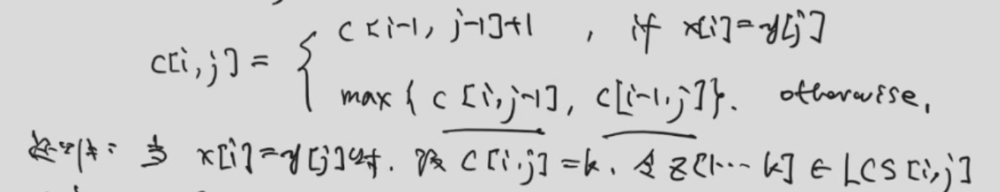
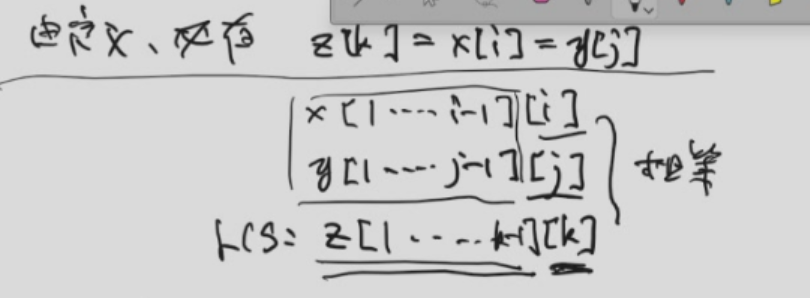
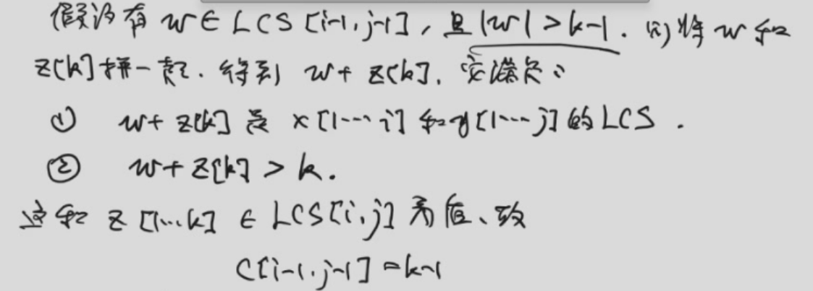
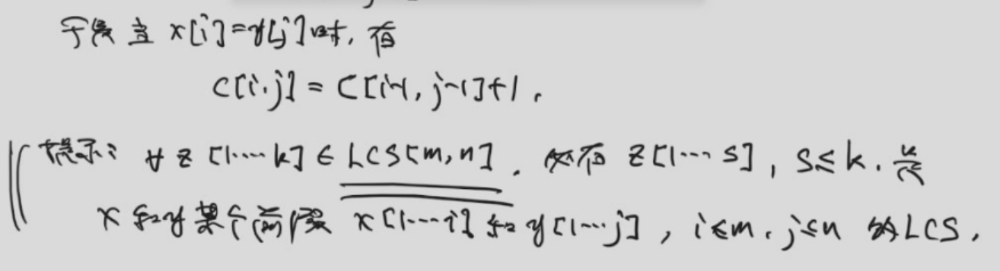
一般化：最优解的部分是部分问题的最优解，被称为最优子结构（optimal substructure）.下面给出LCS问题的算法
```
def LCS_length(X, Y):
    m = len(X)
    n = len(Y)
    c = [[0] * (n + 1) for _ in range(m + 1)]
    for i in range(1, m + 1):
        for j in range(1, n + 1):
            if X[i - 1] == Y[j - 1]:
                c[i][j] = c[i - 1][j - 1] + 1
            else:
                c[i][j] = max(c[i - 1][j], c[i][j - 1])
    return c
```

# Lesson 13
