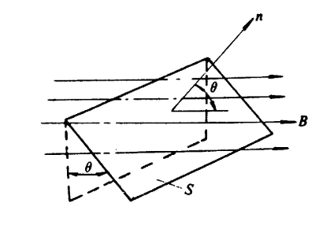
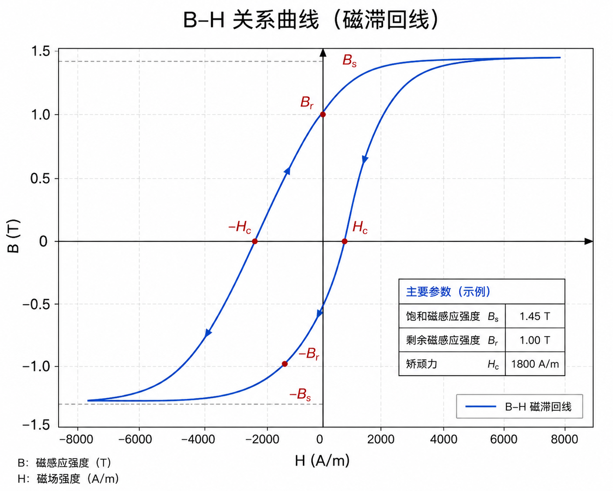

# 一. 绪论
## 1.两个基础定理
基尔霍夫定理: 电流定理，电压定理
$$\boxed{\begin{align*} \sum I &= 0 ，\sum U= 0 \end{align*}}
$$
能量守恒定理
## 2.基本电磁定律
### 1）基本物理量
注意区分磁通密度B和磁场强度H
（1）磁通密度B（T）
（2）磁通量Φ（Wb）

   
  

Φ=BScosθ
  

（3）磁场强度H（A/m）
- 磁场强度H与磁感应密度B的关系 $\boxed{B = \mu H = \mu_0 \mu_r H}$ （非线性）

 

   - 矫顽力$H_c$     小的是软磁（细长型），用来做电机的铁芯
             大的是硬磁（宽肥型），用来做永磁体
   - $\mu$由材料决定
         起始磁化阶段：随H增大$\mu$快速增大；
         膝点 / 拐点附近: $\mu$达到峰值；
         饱和阶段: $\mu = B/H$ 随 H 增大而持续减小（铁磁材料的饱和性）;
   - 真空磁导率$\mu_0 = 4\pi \times 10^{-7}\ (\text{H/m})$
   - 相对磁导率$\boxed{\mu_r = \mu / \mu_0}$，一般铁磁材料的$\mu_r>>1$
### 2）核心磁路公式

安培环路定理    $\oint_{l} \mathbf{H} \cdot d\mathbf{l} = \sum I = NI$
上式可简化为    $\boxed{F = Hl = NI}$ *（适用于均匀磁路）* 

其中磁动势F，可与电动势E类比：
        电路欧姆定律 $E=IR$
        磁路欧姆定律$\boxed{F = \Phi R_m}$ ,  磁通量$\Phi$类比电流$I$，
                            磁阻$\boxed{R_m = \frac{l}{\mu S}}$类比电阻$R$
        [[磁路欧姆定律的推导]]
    
