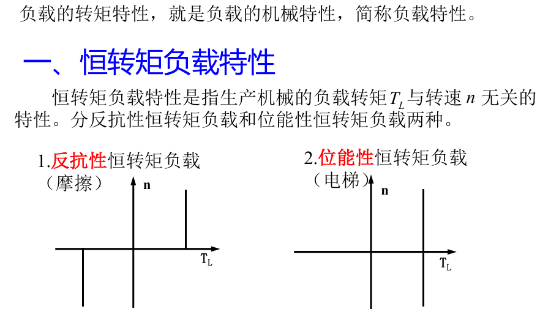
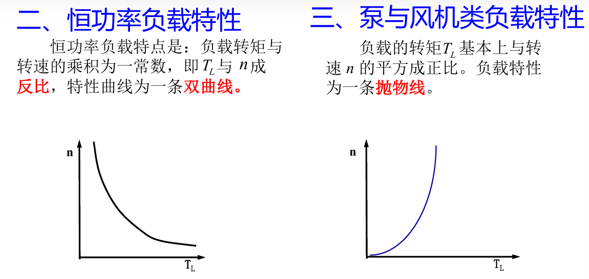

# 一. 绪论

## 1.两个基础定理
基尔霍夫定理: 电流定理，电压定理
$$\boxed{\begin{align*} \sum I &= 0 ，\sum U= 0 \end{align*}}
$$
能量守恒定理

---
## 2.基本电磁定律
### 1）基本物理量
注意区分磁通密度B和磁场强度H
（1）磁通密度B（T）
（2）磁通量Φ（Wb）

   
  

Φ=BScosθ
  

（3）磁场强度H（A/m）
- 磁场强度H与磁感应密度B的关系 $\boxed{B = \mu H = \mu_0 \mu_r H}$ （非线性）

 

   - 矫顽力$H_c$     小的是软磁（细长型），用来做电机的铁芯
             大的是硬磁（宽肥型），用来做永磁体
   - $\mu$由材料决定
         起始磁化阶段：随H增大$\mu$快速增大；
         膝点 / 拐点附近: $\mu$达到峰值；
         饱和阶段: $\mu = B/H$ 随 H 增大而持续减小（铁磁材料的饱和性）;
   - 真空磁导率$\mu_0 = 4\pi \times 10^{-7}\ (\text{H/m})$
   - 相对磁导率$\boxed{\mu_r = \mu / \mu_0}$，一般铁磁材料的$\mu_r>>1$
### 2）核心磁路公式

电磁感应定理 $\boxed{e=−N\frac{d\Phi}{dt}}$，其中负号代表阻碍，==相位关系：e滞后Φ90°，Φ滞后U90==°
                                       [[相位分析]]
安培环路定理    $\oint_{l} \mathbf{H} \cdot d\mathbf{l} = \sum I = NI$
上式可简化为    $\boxed{F = Hl = NI}$ ==（I是励磁电流，产生主磁通）==*（适用于均匀磁路）* 

其中磁动势F，可与电动势E类比：
        电路欧姆定律 $E=IR$
        磁路欧姆定律$\boxed{F = \Phi R_m}$ ,  磁通量$\Phi$类比电流$I$，
                            磁阻$\boxed{R_m = \frac{l}{\mu S}}$类比电阻$R$
        [[磁路欧姆定律的推导]]
电感的公式
         磁链： $\psi = N \cdot \phi$
         电感： $L = \frac{\psi}{i} = \frac{N \cdot \phi}{i} = \frac{N}{i} \cdot \frac{N \cdot i}{R_m} = \frac{N^2}{R_m}$
         简化为：$$\boxed{ L = \frac{N^2}{R_m}={N^2}\Lambda_m} $$        其中  $N$为线圈匝数
                   $\Lambda_m$为磁导（类比电导，磁阻的倒数）
                   
推论1：磁动势和磁场能量主要落在气隙上

1.磁动势分析：对铁芯和气隙来说，主磁通 $\Phi=BS$ 不变(忽略漏磁通时)$$F = NI = H_{Fe}l_{Fe} + H_{\delta}l_{\delta} = R_{mFe} \phi + R_{m\delta} \phi$$$$R_m = \frac{l}{\mu S}$$其中$I$是==励磁电流==，$\delta$代表气隙
因为$\boxed{\mu>>\mu_0}$ (量级比$l$大) ,  所以$\boxed{R_{mFe} << R_{m\delta}}$ ,磁动势主要落在气隙上
  
2.能量分析：对铁芯和气隙来说，主磁路的磁感应强度 B 是相同的(截面积 S 不变）

$$w_m​=\frac{1}{2}​BH = \frac{B^2}{2\mu}$$

因为$\boxed{\mu>>\mu_0}$ (量级比$l$大) ,  所以$\boxed{w_{mFe} << w_{m\delta}}$ ,磁场能量主要落在气隙上

推论2：气隙越小越好
原因：气隙越小，磁阻越小，励磁电流If越小越好
磁路中，气隙磁阻是：
$$R_{m\delta} = \frac{l_\delta}{\mu_0 S}$$
即使气隙长度 $l_\delta$ 很小，由于空气磁导率 $\mu_0$ 远小于铁芯磁导率 $\mu$，
                    气隙磁阻$R_{m\delta}$也会成为总磁阻$R_m$的主要部分
磁动势 $F = NI = \Phi R_m$，当磁通 $\Phi$ 一定时： $\boxed{l_\delta 越小 → R_{m\delta} 越小 → 总磁阻 R_m 越小→励磁电流 I = \dfrac{\Phi R_m}{N} 越小}$
  **好处：**
- 减少无功功率消耗，提升功率因数(励磁电流是无功电流)
- 降低励磁损耗，减少绕组发热
---
## 3.机械特性
### 1）负载的转矩特性

### 2）转矩平衡方程
电动机：$T_{em}=T_0+ T_2$，电磁转矩是动力矩，电磁转矩转化为输出转矩和空载转矩
发电机：$T_1=T_{em}+T_0$，电磁转矩是阻力矩，输入转矩转换为电磁转矩和空载转矩

---
# 二.直流电机
- 定子部分：建立主磁场
- 转子部分：感应电势，产生电磁转矩
---
## 1. 工作原理
 
### 1) 直流电动机
 
- 核心关系：$\boxed{f = Bli}$，$T_e$ 为动力矩，$E_a$ 为反电动势
- 原理：载流导体在磁场中产生电磁力，驱动转子旋转
 
### 2) 直流发电机
 
- 核心关系：$\boxed{e = Blv}$，$E_a$ 为电源，$T_e$ 为阻力矩
- 原理：运动导体切割磁场产生感应电动势，实现机械能→电能转换

---

## 2. 基本结构(了解)
 
### 1) 定子（通直流励磁电流产生磁场）
 
- 铁心：采用僧帽型设计，使主极铁心与转子间的气隙较小、分布均匀
- 主磁极铁心：用钢片叠压而成（磁场恒定，无铁耗）
### 2) 转子（内部为交流电，外部输入/输出为直流电)
                                            （外特性是直流电机名字的由来）
- 转子电枢铁心中是交变磁场，铁耗较大，直流电机的转子采用硅钢片
- $\boxed{铁耗\left\{\begin{aligned}&\text{涡流损耗：交变磁场产生涡流} \\[8pt]&\text{磁滞损耗：反复磁化，磁畴摩擦} \\\end{aligned}\right.}$
- 硅钢片的作用     1.增大电阻率（硅）：减小涡流（欧姆定律）
                2.减小厚度（片）：减小涡流损耗
                3.软磁材料（硅钢）：减小磁滞损耗   
- 换向器：将电枢绕组内的交流电转换为电刷端的直流电

---

## 3.基本方程
 
(1) 感应电动势和电磁转矩方程
 
- 感应电动势：$$\boxed{E_a = C_e \Phi n \qquad C_e = \frac{pN}{60a}}$$ 其中Ce：电动势常数  ，p：极对数   ，N：电枢绕组总导体数，
        a：并联支路数   ，n：转速（单位：r/min） ，60：对应r/min
    
- 电磁转矩和电磁功率，机械角速度和转速的关系： $$P_{e} = E_a I_a = T_{e} \Omega \qquad \Omega = \frac{2\pi n}{60}$$
- 电磁转矩：

$$\boxed{T_e = C_T \Phi I_a \qquad C_T = \frac{pN}{2\pi a}}$$
- 转矩常数与电动势常数的关系：$$\boxed{\frac{C_T}{C_e} = \frac{60}{2\pi} \approx 9.55}$$
(2)电压平衡方程
 
- 电动机电压平衡方程：$$U = E_a + I_a R_a$$                        $I_a R_a$ 为电枢回路的压降，$E_a$ 为反电动势

- 发电机电压平衡方程：$$E_a = U + I_a R_a$$
*注：若考虑串励、复励电机，方程还会与励磁电流 If 的回路有关，需注意串并联区别。*
 
(3) 转矩平衡方程
- 发电机：$T_1 = T_{em} + T_0$
- 电动机：$T_{em} = T_2 + T_0$

---

## 4. 损耗分类

### （1）铜耗（$P_{\text{Cu}}$）
- 电枢铜耗（焦耳损耗）：$\boxed{P_{\text{Cua}} = I_a^2 R_a}$
- 电刷接触损耗：$P_C = 2 I_a \cdot \Delta U_b$ ，其中 $\Delta U_b$ 为每个电刷的压降
### （2）铁耗（$P_{\text{Fe}}$）
- 磁滞损耗$p_h$：交变磁化引起，由磁畴摩擦产生
- 涡流损耗$p_e$：交变磁场在铁心中感应涡流产生
 $$\boxed{p_{Fe} = p_h + p_e = K_{Fe} f^\beta B_m^2 G} \qquad 其中\beta一般取1.3$$
 即：铁耗与==磁场变化频率== $f$ 的==1.3次方==和==铁芯中磁感应强度的最大值$B_{m}$==的==2次方==相关
### （3）机械损耗（$P_{\Omega}$）
包括轴承摩擦、电刷摩擦和风阻摩擦等损耗

### （4）杂散（附加）损耗（$P_\Delta$）
由电枢反应、漏磁场等因素引起的附加损耗

理想空载标志：$I_a=0$，且 $n≠0$ ，没有机械能电能间的能量转换
此时空载损耗 $P_0$ 主要包含铁耗和机械损耗，没有铜耗，空载损耗$P_0$为：$$\boxed{P_0=P_{Fe}+P_{\Omega}+P_\Delta}$$

---

## 5. 功率平衡方程

### 并励直流电动机
- 输入功率：$P_1 = UI$
- 电磁功率：$P_e = T_e \Omega$
- 输出功率：$P_2$（机械功率）

损耗流程：
$P_1$ → 电枢铜耗 $P_{\text{Cu,a}}$、励磁铜耗 $P_{\text{Cu,f}}$ → 电磁功率 $P_e$ → 铁耗 $P_{\text{Fe}}$、机械损耗 $P_{\Omega}$、杂散损耗 $P_\Delta$ → $P_2$

### 并励直流发电机
- 输入功率：$P_1$（机械功率）
- 电磁功率：$P_e = E_a I_a$
- 输出功率：$P_2 = UI$
损耗流程：
$P_1$ → 机械损耗 $P_{\Omega}$ → 电磁功率 $P_e$ → 电枢铜耗 $P_{\text{Cu,a}}$、励磁铜耗 $P_{\text{Cu,f}}$、铁耗 $P_{\text{Fe}}$、杂散损耗 $P_\Delta$ → $P_2$
 
 